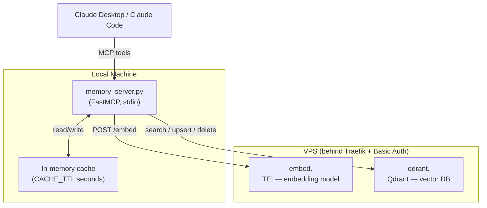
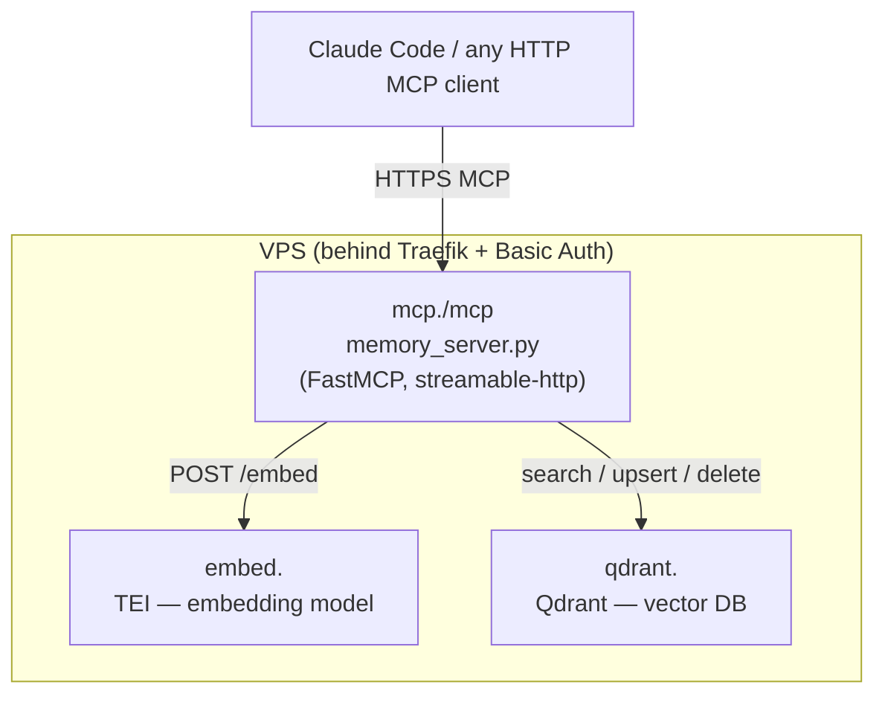
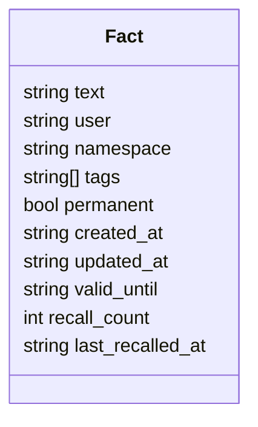
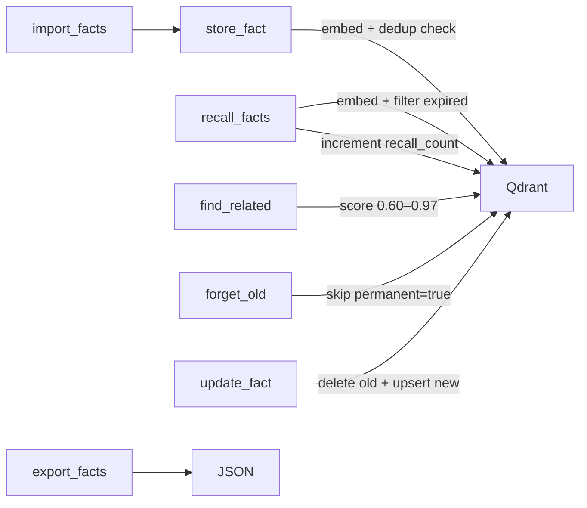

# Personal Memory Stack

Self-hosted semantic memory for any MCP-compatible AI client. Stores and retrieves facts using vector embeddings — no third-party cloud, all data stays on your VPS.

## Stack

| Component | Role |
|---|---|
| [Qdrant](https://qdrant.tech/) | Vector database |
| [Text Embeddings Inference](https://github.com/huggingface/text-embeddings-inference) | Local embedding model server |
| [intfloat/multilingual-e5-small](https://huggingface.co/intfloat/multilingual-e5-small) | Embedding model (multilingual, ~470MB) |
| [FastMCP](https://github.com/jlowin/fastmcp) | MCP server bridging Claude with the stack |
| Traefik v3 | Reverse proxy, SSL, Basic Auth |

## Architecture

`memory_server.py` supports two transport modes controlled by `MCP_TRANSPORT` env var:

### Mode 1: stdio (local, default)



### Mode 2: HTTP remote (MCP_TRANSPORT=http)



Auth is handled by Traefik's Basic Auth middleware. `memory_server.py` passes credentials via `httpx.BasicAuth` — never embedded in URLs.

## Data Model

Each stored fact is a Qdrant point with the following payload:



- **namespace** — logical group (`work`, `personal`, `projects`, …)
- **permanent** — if `true`, never deleted by `forget_old()`
- **valid_until** — ISO date; expired facts are excluded from search results
- **recall_count** — incremented each time the fact is returned by `recall_facts`

## MCP Tools

### Writing

| Tool | Description |
|---|---|
| `store_fact(fact, tags?, namespace?, permanent?, valid_until?)` | Embed and save a fact. Skips near-duplicates (cosine ≥ 0.97). Warns about potentially contradicting facts (cosine 0.60–0.97). |
| `update_fact(old_query, new_fact, tags?, namespace?, permanent?)` | Semantically find a fact and replace it. Preserves metadata unless overridden. |
| `delete_fact(query, namespace?)` | Semantically find and delete the closest matching fact. |
| `forget_old(days?, namespace?, dry_run?)` | Delete facts older than N days. Skips `permanent=true`. Default: `dry_run=true`. |
| `import_facts(facts)` | Bulk import from a list of dicts (e.g. from `export_facts`). Deduplicates on import. |

### Reading

| Tool | Description |
|---|---|
| `recall_facts(query, tags?, namespace?, limit?)` | Semantic search. Returns facts with scores. Filters expired facts. Increments `recall_count`. |
| `list_facts(tags?, namespace?)` | List all facts with metadata. Shows expired count separately. |
| `find_related(query, namespace?, limit?)` | Find semantically related facts that are not direct duplicates (score 0.60–0.97). |
| `get_stats()` | Total counts, namespace breakdown, tag distribution, most recalled facts. |
| `list_tags(namespace?)` | All unique tags with usage counts. |
| `export_facts(namespace?)` | Export all facts as JSON for backup or migration. |

### Tool flow



## Prerequisites (VPS)

- Docker + Docker Compose
- Traefik v3 running with:
  - External network named `traefik`
  - `letsEncrypt` certresolver configured
  - `traefik-auth` Basic Auth middleware configured

## Server Setup (VPS)

```bash
mkdir -p /root/memory/qdrant_storage
cp .env.vps.example .env.vps
nano .env.vps
docker compose --env-file .env.vps up -d
```

`.env.vps` variables:

| Variable | Description |
|---|---|
| `MEMORY_DOMAIN` | Your domain, e.g. `example.com` — services at `embed.<domain>`, `qdrant.<domain>`, `mcp.<domain>` |
| `EMBED_MODEL` | HuggingFace model ID, default `intfloat/multilingual-e5-small` |

Track TEI model download on first start:
```bash
docker logs -f memory-embeddings
# Ready when you see: Ready
```

Verify Qdrant:
```bash
curl https://qdrant.<your-domain>/healthz
# → {"title":"qdrant - Ready"}
```

## Local Setup

**1. Python environment**

```bash
python3.12 -m venv venv
venv/bin/pip install -r requirements.txt
```

**2. Credentials**

```bash
cp .env.example .env
nano .env
```

`.env` variables:

| Variable | Description |
|---|---|
| `MEMORY_USER` | Basic Auth username |
| `MEMORY_PASS` | Basic Auth password |
| `MEMORY_DOMAIN` | Your domain |
| `CACHE_TTL` | Search cache TTL in seconds (default: `60`) |
| `DEDUP_THRESHOLD` | Cosine similarity threshold for deduplication (default: `0.97`) |
| `CONTRADICTION_LOW` | Lower bound for contradiction warning (default: `0.60`) |
| `QDRANT_URL` | Override Qdrant URL (default: `https://qdrant.<DOMAIN>`) |
| `EMBED_URL` | Override TEI URL (default: `https://embed.<DOMAIN>`) |

**3. Claude Desktop config**


| OS | Example file | Config location |
|---|---|---|
| macOS | `claude_desktop_config.mac.json` | `~/Library/Application Support/Claude/claude_desktop_config.json` |
| Windows | `claude_desktop_config.windows.json` | `%APPDATA%\Claude\claude_desktop_config.json` |

Restart Claude Desktop after merging the config.

**4. Claude Code — stdio (local)**

Add to `~/.claude.json` under `mcpServers`:

```json
"personal-memory": {
  "command": "/path/to/venv/bin/python3.12",
  "args": ["/path/to/memory_server.py"]
}
```

**5. Claude Code — remote HTTP (no local Python needed)**

After deploying the `memory-mcp` service on your VPS, run once:

```bash
claude mcp add --transport http personal-memory \
  https://mcp.yourdomain.com/mcp \
  --header "Authorization: Basic $(echo -n 'user:pass' | base64)"
```

Replace `yourdomain.com`, `user`, and `pass` with your values. That's it.

> **Note:** Claude Desktop does not support custom headers in MCP config — it only supports OAuth or authless servers. For Claude Desktop, use the local stdio mode (options 3+4 above).

## Security Notes

| Risk | Severity | Notes |
|---|---|---|
| Credentials in `.mcp.json` | High | Use env var substitution (`${VAR}`); file is gitignored |
| Qdrant accessible to all containers on `traefik` network | Medium | Standard Docker trust model; isolate with a separate internal network if needed |
| 32-bit point ID space (MD5 truncation) | Low | Collisions possible beyond ~65k facts; duplicate text silently overwrites existing point |
| Sync HTTP calls in async HTTP mode | Low | Blocks event loop under concurrent requests; not an issue for personal single-user use |

## Collection

The Qdrant collection (`memory`) is created automatically on server startup. After the first `store_fact` call it will be visible at `https://qdrant.<your-domain>/dashboard`.

## Best Practices

To get the most out of persistent memory, instruct your AI client to use it proactively. For Claude Code, add the following to your global CLAUDE.md:

| OS | Path |
|---|---|
| macOS / Linux | `~/.claude/CLAUDE.md` |
| Windows | `%USERPROFILE%\.claude\CLAUDE.md` |

````markdown
## Personal Memory (MCP: personal-memory)

The `personal-memory` MCP server is always available. Use it proactively — don't wait to be asked.

### When to recall
- At the start of any session involving a known project — run `recall_facts` to load context
- Before making architectural decisions — check if relevant preferences or past decisions are stored
- When the user references established context ("as usual", "like before", "you know I prefer...")

### When to store
- User states a preference or decision that should persist ("always use X", "never do Y")
- A non-obvious fact about a project is established (tech stack, naming convention, key dependency)
- Something important was learned that would be useful in future sessions

### Namespace convention
Always specify a namespace. Never store everything in `default`.

| Context | Namespace |
|---|---|
| Personal preferences, habits | `personal` |
| Current project | `<project-name>` |
| Cross-project technical preferences | `tech` |
| Work / professional context | `work` |

### Permanent facts
Use `permanent=True` for facts that should never expire:
fundamental preferences, identity facts, long-term architectural decisions.

### Tags
- `#decision` — architectural or product decisions
- `#preference` — personal or workflow preferences
- `#constraint` — things to avoid or never do
````
