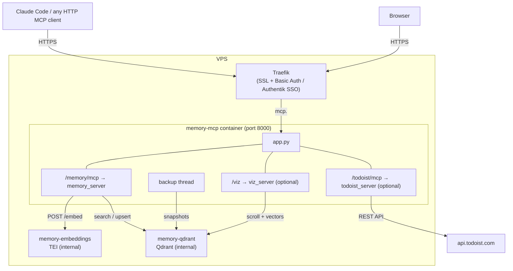
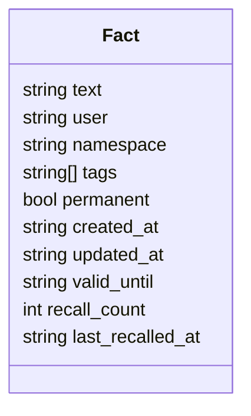
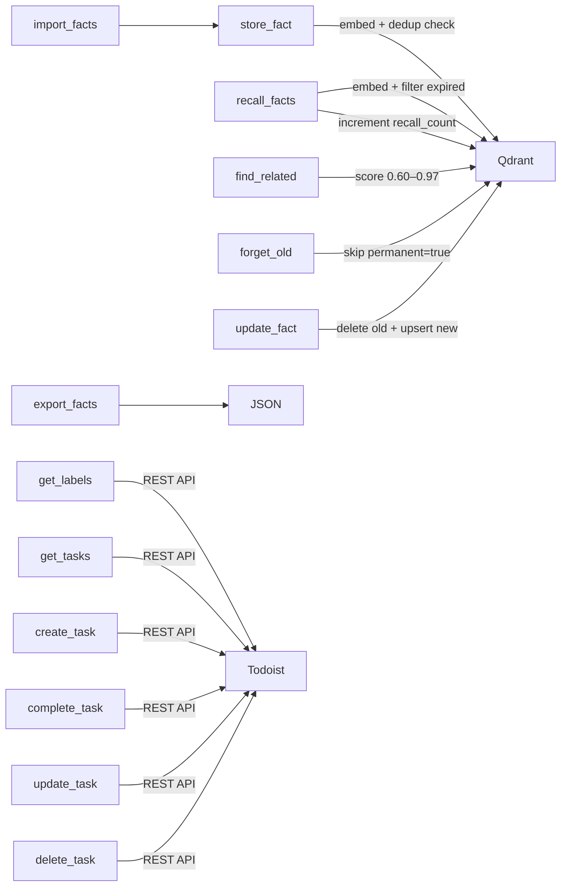

# Personal Memory Stack

Self-hosted semantic memory + Todoist integration for any MCP-compatible AI client. Stores and retrieves facts using vector embeddings, and exposes Todoist as a server-side MCP tool — no third-party cloud auth needed, all credentials stay on your VPS.

## Stack

| Component | Role |
|---|---|
| [Qdrant](https://qdrant.tech/) | Vector database |
| [Text Embeddings Inference](https://github.com/huggingface/text-embeddings-inference) | Local embedding model server |
| [intfloat/multilingual-e5-small](https://huggingface.co/intfloat/multilingual-e5-small) | Embedding model (multilingual, ~470MB) |
| [FastMCP](https://github.com/jlowin/fastmcp) | MCP server bridging Claude with the stack |
| [vis.js](https://visjs.org/) | Interactive graph and timeline visualization |
| Traefik v3 | Reverse proxy, SSL, Basic Auth / Authentik SSO, path routing |

## Architecture

Three Docker services. All Python code runs in one container (`memory-mcp`):



TEI and Qdrant are internal only — not exposed outside the Docker network. Qdrant dashboard is available on `localhost:6333` for debugging.

Routing is handled inside `app.py` — Traefik only proxies `mcp.<domain>` to port 8000, no path rewrites needed.

### Visualization (`mcp.<domain>/viz`)

- **Graph** — interactive force-directed network (vis.js). Nodes = facts, edges = cosine similarity above threshold.
- **Timeline** — facts plotted by creation date, grouped by namespace.

Auth is handled by Traefik: Authentik ForwardAuth for browser access, Basic Auth as programmatic fallback. `TODOIST_TOKEN` lives in `.env` on the server — never passed by the client.

## Data Model

Each stored fact is a Qdrant point with the following payload:



- **namespace** — logical group (`work`, `personal`, `projects`, …)
- **permanent** — if `true`, never deleted by `forget_old()`
- **valid_until** — ISO date; expired facts are excluded from search results
- **recall_count** — incremented each time the fact is returned by `recall_facts`

## MCP Tools

### memory_server.py — Writing

| Tool | Description |
|---|---|
| `store_fact(fact, tags?, namespace?, permanent?, valid_until?)` | Embed and save a fact. Skips near-duplicates (cosine ≥ 0.97). Warns about potentially contradicting facts (cosine 0.60–0.97). |
| `update_fact(old_query, new_fact, tags?, namespace?, permanent?)` | Semantically find a fact and replace it. Preserves metadata unless overridden. |
| `delete_fact(query, namespace?)` | Semantically find and delete the closest matching fact. |
| `forget_old(days?, namespace?, dry_run?)` | Delete facts older than N days. Skips `permanent=true`. Default: `dry_run=true`. |
| `import_facts(facts)` | Bulk import from a list of dicts (e.g. from `export_facts`). Deduplicates on import. |

### memory_server.py — Reading

| Tool | Description |
|---|---|
| `recall_facts(query, tags?, namespace?, limit?)` | Semantic search. Returns facts with scores. Filters expired facts. Increments `recall_count`. |
| `list_facts(tags?, namespace?)` | List all facts with metadata. Shows expired count separately. |
| `find_related(query, namespace?, limit?)` | Find semantically related facts that are not direct duplicates (score 0.60–0.97). |
| `get_stats()` | Total counts, namespace breakdown, tag distribution, most recalled facts. |
| `list_tags(namespace?)` | All unique tags with usage counts. |
| `export_facts(namespace?)` | Export all facts as JSON for backup or migration. |

### todoist_server.py

| Tool | Description |
|---|---|
| `get_projects()` | List all Todoist projects with IDs. |
| `get_labels()` | List all personal labels with IDs. |
| `get_tasks(project_id?, filter?, limit?)` | List active tasks. `filter` uses Todoist filter syntax (e.g. `today`, `overdue`, `#Work`, `@label`). Tasks show labels in output. |
| `create_task(content, project_id?, due_string?, priority?, labels?)` | Create a task. `labels` is a list of label names, e.g. `["work"]`. Priority 1–4. |
| `complete_task(task_id)` | Mark a task as complete. |
| `update_task(task_id, content?, due_string?, priority?, labels?)` | Update an existing task. Pass `labels=[]` to clear all labels. |
| `delete_task(task_id)` | Delete a task permanently. |

### Tool flow



## Prerequisites (VPS)

- Docker + Docker Compose
- Traefik v3 running with:
  - External network named `traefik`
  - `letsEncrypt` certresolver configured
  - `traefik-auth` Basic Auth middleware configured

## Server Setup (VPS)

```bash
mkdir -p /root/memory/qdrant_storage
mkdir -p /root/memory/qdrant_snapshots
cp .env.example .env
nano .env
docker compose up -d
```

`.env` variables:

| Variable | Description |
|---|---|
| `MEMORY_DOMAIN` | Your domain, e.g. `example.com` — MCP available at `mcp.<domain>` |
| `EMBED_MODEL` | HuggingFace model ID, default `intfloat/multilingual-e5-small` |
| `ENABLE_TODOIST` | Set to `true` to enable Todoist MCP server (default: `false`) |
| `ENABLE_VIZ` | Set to `true` to enable visualization dashboard (default: `false`) |
| `TODOIST_TOKEN` | Todoist API token — get it at Settings → Integrations → Developer (only needed when `ENABLE_TODOIST=true`) |
| `KEEP_SNAPSHOTS` | Number of snapshots to retain (default: `7`) |
| `BACKUP_INTERVAL_HOURS` | How often the backup runs (default: `24`) |
| `VIZ_SIMILARITY_THRESHOLD` | Default similarity threshold for graph edges (default: `0.65`, only when `ENABLE_VIZ=true`) |

Three Docker services: `memory-embeddings`, `memory-qdrant`, `memory-mcp`. The `memory-mcp` container runs all Python services (memory, backup, and optionally todoist + viz) via `app.py`.

Track TEI model download on first start:
```bash
docker logs -f memory-embeddings
# Ready when you see: Ready
```

Verify Qdrant (on VPS):
```bash
curl http://localhost:6333/healthz
# → {"title":"qdrant - Ready"}
```

## Backups

Backup runs as a background thread inside `memory-mcp` — no separate service or cron needed.

- Creates a Qdrant snapshot every `BACKUP_INTERVAL_HOURS` hours (default: 24)
- Snapshots are stored at `/root/memory/qdrant_snapshots/` on the host
- Keeps the last `KEEP_SNAPSHOTS` snapshots (default: 7), deletes older ones

**Backup logs** appear in `docker logs memory-mcp`.

**Snapshots are stored locally on the VPS only.** Point rsync, rclone, or Resilio Sync at `/root/memory/qdrant_snapshots/` — snapshots are self-contained `.snapshot` files, safe to copy at any time.

**To restore from a snapshot:**
```bash
curl -X POST "http://localhost:6333/collections/memory/snapshots/recover" \
  -H "Content-Type: application/json" \
  -d '{"location": "file:///qdrant/snapshots/memory/<snapshot-name>.snapshot"}'
```

## Client Setup

After deploying services on your VPS:

First, generate your Base64 token:
```bash
echo -n 'user:pass' | base64
# → dXNlcjpwYXNz
```

Then configure your client. Two separate MCP servers:

| Field | Memory | Todoist |
|---|---|---|
| Type | Streamable HTTP | Streamable HTTP |
| URL | `https://mcp.yourdomain.com/memory/mcp` | `https://mcp.yourdomain.com/todoist/mcp` |
| Header key | `Authorization` | `Authorization` |
| Header value | `Basic dXNlcjpwYXNz` | `Basic dXNlcjpwYXNz` |

**Claude Code** — add both with one command each (add `--scope user` to make available across all projects):
```bash
TOKEN=$(echo -n 'user:pass' | base64)

claude mcp add --transport http personal-memory https://mcp.yourdomain.com/memory/mcp \
  --header "Authorization: Basic $TOKEN" \
  --scope user

claude mcp add --transport http todoist https://mcp.yourdomain.com/todoist/mcp \
  --header "Authorization: Basic $TOKEN" \
  --scope user
```

## Security Notes

| Risk | Severity | Notes |
|---|---|---|
| Credentials in `.mcp.json` | High | Use env var substitution (`${VAR}`); file is gitignored |
| Qdrant accessible to all containers on `traefik` network | Medium | Standard Docker trust model; isolate with a separate internal network if needed |
| Sync HTTP calls in async HTTP mode | Low | Blocks event loop under concurrent requests; not an issue for personal single-user use |

## Visualization Dashboard

After deployment, open `https://mcp.<your-domain>/viz` in a browser (requires Authentik SSO login).

Features:
- **Graph view** — interactive force-directed graph (vis.js Network). Nodes = facts, edges = cosine similarity above threshold. Node size = recall count, color = namespace, thick border = permanent fact. Adjust similarity threshold with a slider.
- **Timeline view** — facts plotted on a timeline (vis.js Timeline), grouped by namespace. Zoom and pan to explore.
- **Filters** — filter by namespace, click tags to toggle filtering, adjust similarity threshold.
- **Detail panel** — click any fact to see full text, namespace, tags, creation date, recall count.

## Collection

The Qdrant collection (`memory`) is created automatically on server startup. After the first `store_fact` call it will be visible at `http://localhost:6333/dashboard` on the VPS.

## Best Practices

To get the most out of persistent memory, instruct your AI client to use it proactively. For Claude Code, add the following to your global CLAUDE.md:

| OS | Path |
|---|---|
| macOS / Linux | `~/.claude/CLAUDE.md` |
| Windows | `%USERPROFILE%\.claude\CLAUDE.md` |

````markdown
## Personal Memory (MCP: personal-memory)

The `personal-memory` MCP server is always available. Use it proactively — don't wait to be asked.

### When to recall
- At the start of any session involving a known project — run `recall_facts` to load context
- Before making architectural decisions — check if relevant preferences or past decisions are stored
- When the user references established context ("as usual", "like before", "you know I prefer...")

### When to store
- User states a preference or decision that should persist ("always use X", "never do Y")
- A non-obvious fact about a project is established (tech stack, naming convention, key dependency)
- Something important was learned that would be useful in future sessions

### Namespace convention
Always specify a namespace. Never store everything in `default`.

| Context | Namespace |
|---|---|
| Personal preferences, habits | `personal` |
| Current project | `<project-name>` |
| Cross-project technical preferences | `tech` |
| Work / professional context | `work` |

### Permanent facts
Use `permanent=True` for facts that should never expire:
fundamental preferences, identity facts, long-term architectural decisions.

### Tags
- `#decision` — architectural or product decisions
- `#preference` — personal or workflow preferences
- `#constraint` — things to avoid or never do
````
